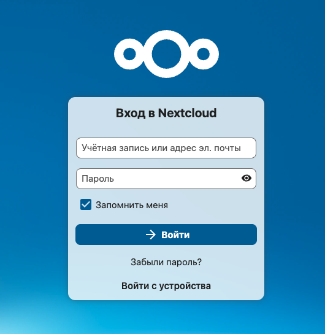
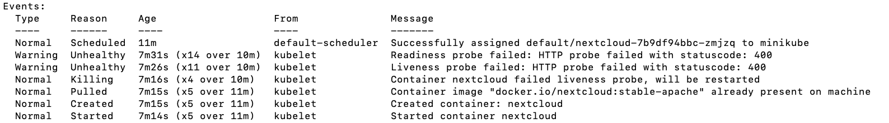

# Kubernetes (Nextcloud + PostgreSQL)

## Описание
В рамках ЛР3 развернут **Nextcloud** в связке с  **PostgreSQL** внутри кластера Kubernetes (Minikube). 

## Структура репы
* `postgres-deployment.yaml` — деплой БД.
* `postgres-service.yaml` — внутренний сервис для БД.
* `postgres-configmap.yaml` — несекретные настройки БД.
* `postgres-secret.yaml` — пароли БД.
* `postgres-pvc.yaml` — монтирование данных БД.
* `nextcloud-deployment.yaml` — деплой Nextcloud (с пробами и маунтами).
* `nextcloud-configmap.yaml` — настройки приложения.
* `nextcloud-secret.yaml` — пароль.
* `nextcloud-pvc.yaml` — монтирование данных Nextcloud.

## Ход работы

### 1. Развернут PostgreSQL с подключением PVC.

### 2. Запуск Nextcloud с PVC
Развернут Nextcloud, подключен к базе данных через переменные окружения.

### 3. Настройка проб (Liveness/Readiness)
Добавлены проверки доступности HTTP.

## ❓ Ответы на вопросы
**Вопрос:** Что произойдет, если отскейлить количество реплик postgres-deployment в 0, затем обратно в 1?
**Ответ:** После рестарта поды по дефолту придется заново проходить авторизацию + пропадут загруженные или измененные файлы. Чтобы такого не было, мы добавили PVC