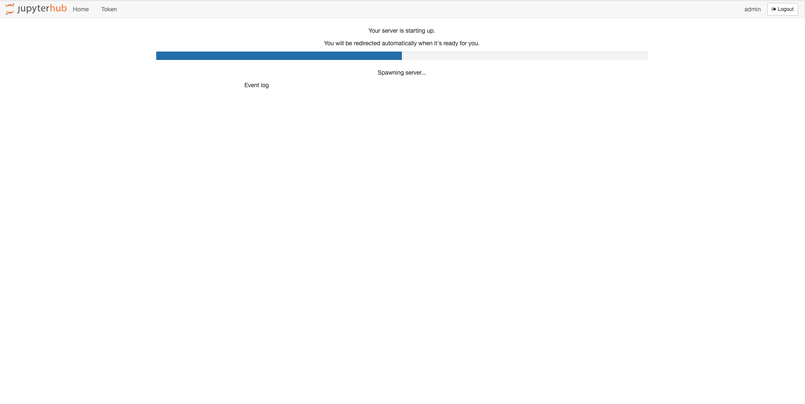
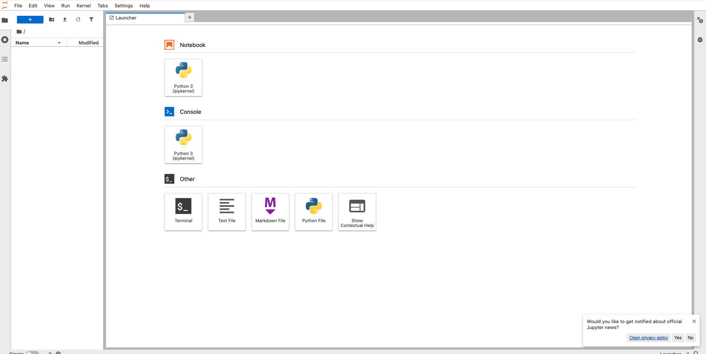

# Kubernetes (Jupyter + PostgreSQL)

В рамках ЛР4 мы развернули JupyterHub в связке PostgreSQL внутри кластера Kubernetes. Архитектура состоит из двух сервисов:

### 1. PostgreSQL

Мы развернули Postgres по аналогии с ЛР3. Подключили к нему PVC. jupyter видит базу с помощью ClusterIP;

### 2. JupyterHub

По началу использовали кастомный образ из ЛР1 (потом доработали).
* Добавили в него библиотеку `jupyterlab`
* Пересобрали образ и залили в minikube

Также добавили **InitContainer**, который запускается перед основным сервисом и проверяет доступность порта. Если бд пока не готова, чекер будет ждать.
Еще настроили проверку готовности **Readiness Probe** (тоже по аналогии с ЛР3). Кубер каждые 10 секунд проверяет, жив ли сервер, прежде чем пускать на него.

### 3. LoadBalancer

Чтобы достучаться до хоста, создали сервис типа **LoadBalancer**. Для него используем `minikube tunnel`

### 4. Итоговый сервис

На скриншотах можно видеть поды и этапы работы с сервисом (авторизация, загрузка и рабочий интерфейс jupyter)

